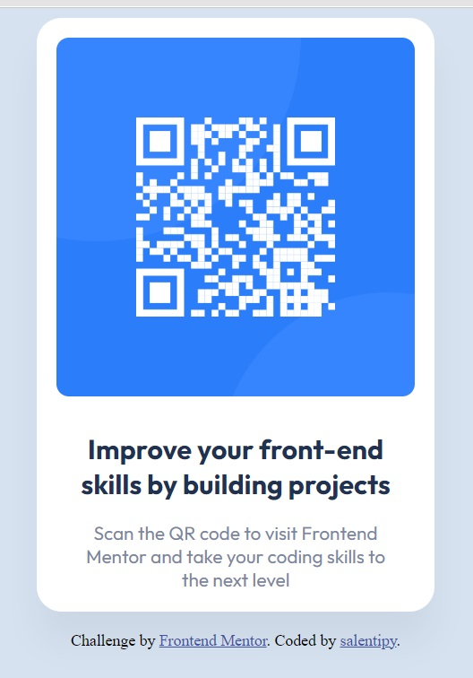

# Frontend Mentor - QR code component solution
3:00 p.m. - 4:44 p.m.

This is a solution to the [QR code component challenge on Frontend Mentor](https://www.frontendmentor.io/challenges/qr-code-component-iux_sIO_H).

## Table of contents

- [Overview](#overview)
  - [Screenshot](#screenshot)
  - [Links](#links)
- [My process](#my-process)
  - [Built with](#built-with)
  - [What I learned](#what-i-learned)
  - [Continued development](#continued-development)
- [Author](#author)
- [Acknowledgments](#acknowledgments)

## Overview
The challenge was to build out a QR code component using only HTML and CSS. 

### Screenshot

### Links

- Solution URL: [Add solution URL here](https://your-solution-url.com)
- Live Site URL: [Add live site URL here](https://your-live-site-url.com)

## My process

* start with semantic HTML
* establish base styles (incl.global variables)
* style the remaining HTML - Lots of CTRL+S and F5!

### Built with

- Semantic HTML5 markup
- CSS custom properties
- Flexbox
- Mobile-first workflow

### What I learned

Just learning how to use Figma. This project was a nice intro to that!

### Continued development

Always looking for best practices especially in regards to accessibility and responsivity. Any feedback received may be added here at a later date.

## Author

- Website - [salentipy](https://github.com/salentipy)
- Frontend Mentor - [@salentipy](https://www.frontendmentor.io/profile/salentipy)
- @salentipy on Mastodon, Twitter/X, Instagram and Threads, CodePen, freeCodeCamp, Spotify, and probably more I can't think of right now. XD

## Acknowledgments

My BFF who is a FED has given me SO much helpful information and resources. I am eternally grateful to her for her support!